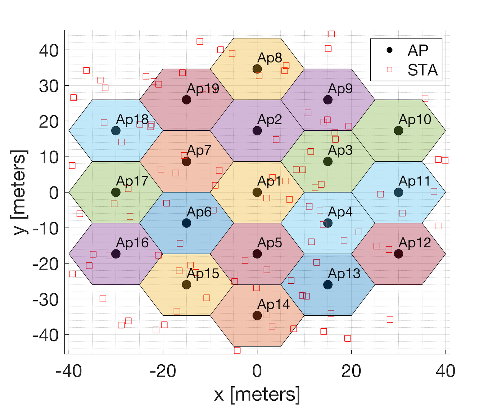
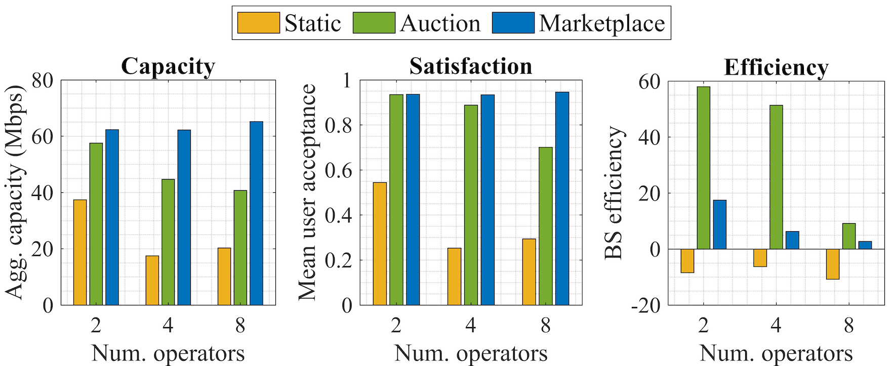
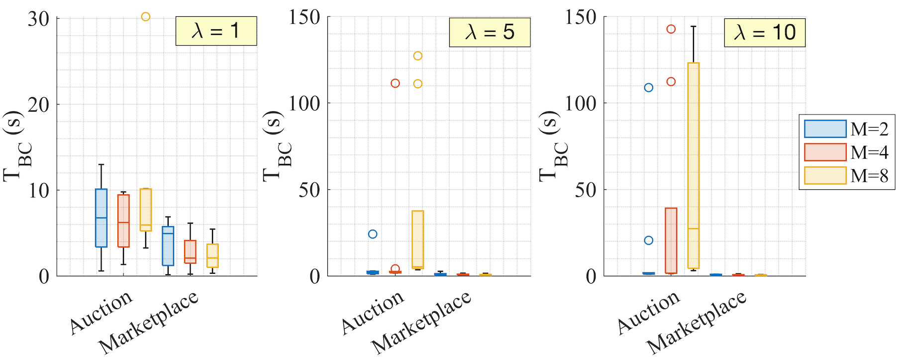
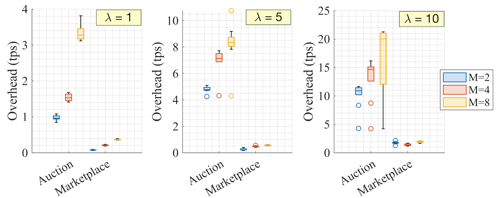
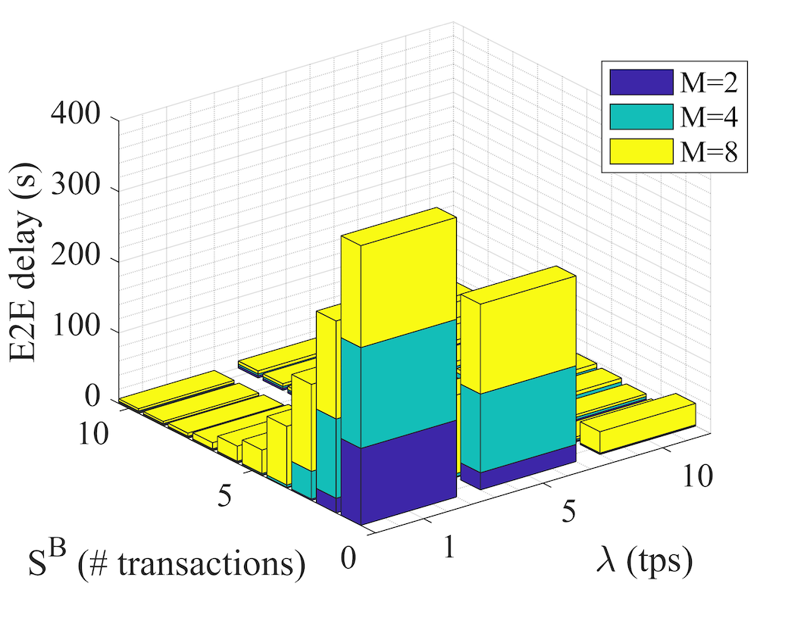
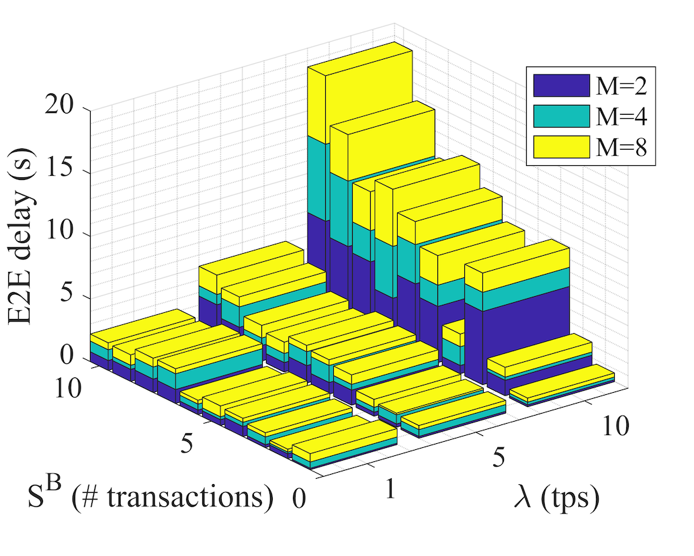

# Blockchain-enabled RAN Sharing for O-RAN #

## Table of Contents
- [Authors](#authors)
- [Publication's abstract](#abstract)
- [Repository description](#repositorydescription)
- [Usage](#usage)
- [Performance Evaluation](#performanceevaluation)
- [References](#references)
- [Contribute](#contribute)

## Authors
* [Lorenza Giupponi](http://www.cttc.es/people/lgiupponi/)
* [Francesc Wilhelmi](https://fwilhelmi.github.io/)

## Abstract
The innovation provided by network virtualization in 5G, together with standardization and openess boosted by the Open Radio Access Network (O-RAN) Alliance, has paved the way to a collaborative future in communications systems, driven by flexible network sharing. Such advents are expected to attract new players like content providers and verticals, thus increasing competitiveness in the mobile market. However, scalability and trust issues are expected to arise, given the criticity of ownership traceability and resource exchanging in an open RAN sharing ecosystem. To address that, we propose the integration of Blockchain (BC) technology for enabling Mobile Network Operators (MNOs) and other players to exchange RAN resources (e.g., infrastructure, spectrum usage) autonomously and dynamically. BC will provide robustness, trustworthiness, and reliability to mobile networks, so that confidence is generated in an open RAN environment. In particular, we define a novel O-RAN-based BC-enabled architecture that allows automating RAN sharing procedures through either auction or marketplace-based mechanisms. The potential advantages of the proposed solution are demonstrated through simulation results. 

## Repository description
This repository contains the necessary files to generate the results included in the "Blockchain-enabled RAN Sharing for O-RAN" publication, which have been obtained from our new ["Blockchain-enabled RAN sharing" simulator](https://bitbucket.org/francesc_wilhelmi/blockchain_ran_sharing_simulator/src). The simulator is open and available to any interested researcher. The files included in this repository are:

1. LaTeX files: contains the files used to generate the manuscript.
2. Matlab code/Simulations: matlab scripts used to process generate the simulation results with the "Blockchain-enabled RAN sharing" simulator.
3. Matlab code/GeneratePlots: matlab scripts used to process the results and plot the figures included in the paper "Blockchain-enabled RAN Sharing for O-RAN".
4. Figures: figures used in the paper "Blockchain-enabled RAN Sharing for O-RAN".

## Usage

To reproduce the experiments done in this paper, select the files in the "Matlab code/Simulations" folder and copy them into the ["Blockchain-enabled RAN sharing" simulator](https://bitbucket.org/francesc_wilhelmi/blockchain_ran_sharing_simulator/src). Then, run the main files (e.g., "main_operators.m").

Once simulations are done, it is possible to plot the results by placing the output files to the appropriate folder (e.g., "/Output") and running the scripts in "Matlab code/PlotResults".

**Disclaimer:** The "Signal Processing Toolbox" is required to execute some of the functions included in the simulator. Besides, Matlab 2021a version and the "Statistics and Machine Learning Toolbox" are required to execute the scripts for some of the plots.

## Performance Evaluation

Two different BC-enabled RAN sharing mechanisms are evaluated in terms of user performance and BC delay and overhead:

1. **Auction:** the selection of the serving OP i is done by means of an auction procedure, which is expected to better satisfy the end users' in terms of price and delivered service. The OP j interested in leasing VNFs/infrstructure/resources from another OP defines the requirements and desired price for the needed resources and send them to the SC creator of the RAN sharing broker of OP j. The SC creator prepares a SC, which is distributed through the BC. Other OPs interested in offering for lease their resources and infrastructure, evaluate availability through admission control functionality, and if the resources are available, participate in the auction offering a bid through the auction engine. The auction engines distribute the bids from the candidate OPs through the BC. The auction engine of OP j collects the bids and decides the target i to host the desired VNFs. From this moment this procedure is similar to the first case. The provisioning request is sent to the hosting OP, to the RAN sharing broker, and an instantiation request is sent to the orchestrator to be instantiated in the platform of site i. 
2. **Marketplace:** All OPs with VNFs, infrastructure and resources to offer advertize them with specific prices in a catalog (i.e., marketplace), where other OP, MVNO, OTT providers or verticals can select the desired service. To participate in the marketplace, the OP registers the information of interest (e.g., available resources, price of resources) in the BC. OPi , interested in leasing a VNF from another OP providing infrastructure, accesses the marketplace to acquire one. After selecting a sharing provider OP j, the SC creator in the RAN sharing broker of OP i prepares a SC defining the SLA, based on the offer identified in the marketplace. This is distributed in the BC and received by the BC adaptor of OP j, which translates the SC into requirements and sends them to the admission control of the SMO for evaluation. If the request is accepted, a VNF is instantiated in OP j's infrastructure to be remotely configured (during the configuration phase) by OP i through the open interfaces defined in O-RAN. During the running phase, the SLA is monitored through RICs at OP i site. If need for update of resources is identified by the SMO, an update service request is sent to the RAN sharing broker and a new SC is prepared by the SC creator, which is then registered in the BC and analyzed by OP i's admission control. If the service can be modified, the request is accepted.

### Simulation parameters

{width=100px}
	
The following Table summarizes the characteristics of the considered simulation scenario:

| **Parameter**          | **Value**        		  |
|------------------------|----------------------------|
| Number of BS/UE        | 19 / 200          		  |
| Cell radius            | 10 m                       |
| Simulation duration    | 300 s                      |

### Simulation configuration

In order to characterize the testbed deployment through simulations, we have used the Blockchain-enabled RAN sharing simulator developed in Matlab, which can be found [here](https://bitbucket.org/francesc_wilhelmi/blockchain_ran_sharing_simulator/src/master/) (commit: a8e0719). The scenario parameters used in the publication are as follows:

| **Parameter**                         | **Value**                                                    |
|---------------------------------------|--------------------------------------------------------------|
| Central frequency                     | 5 GHz                                                        |
| Bandwidth per channel                 | 20 MHz                                                       |
| MCS indexes                           | 0-11                                                         |
| Path-loss model                       | $$Pt − P_L0 + 10\alpha log10(d) + \sigma/2 + d/10 \gamma/2$$ |
| TX/RX gain                            | 0/0 dB                                                       |
| Loss at the reference distance (P_L0) | 5 dB                                                         |
| Path-loss exponent ($$\alpha$$)       | 4.4                                                          |
| Shadowing factor ($$\sigma$$)         | 9.5                                                          |
| Obstacles factor ($$\gamma$$)         | 30                                                           |                                                                                                             
### Simulation Results

First, we focus on the performance achieved by UEs, which results from the application of the proposed BC-enabled RAN sharing solution in the proposed simulation scenario. In particular, we focus on the UE capacity, the UE satisfaction, and the resources efficiency, which are obtained as follows:

1. [Capacity] C(u) = b(u) * log2(1+SINR(u)), where b(u) is the bandwidth assigned to UE "u", and SINR(u) is the SINR experienced by such a user.
2. [Satisfaction] S(u) = 1 - exp(-K * C(u)/R(u))^S_1(u) * (1-P(u))^S_2(u)), where K = 4 is a normalizing constant, C(u) is the capacity obtained by user "u", R(u) is the service requested by such user in terms of capacity, S_1(u) is the user service sensitiviy, P(u) is the price charged to the user, and S_2(u) is the user price sensitivity. Notice that the price charged to users has been defined as a uniform random variable between 0 and 1.
3. [Efficiency] Eff(BS) = 1/(L(BS)-RL(BS)), where L(BS) is the load experienced in a given BS

The following figure shows the results, which are obtained for three different numbers of operators exchanging resources (2, 4, and 8 operators) and for the three possible RAN sharing approaches (static, auction, marketplace).

{width=50%}

As shown, both BC-enabled auction and marketplace-based solutions outperform the static scenario (at which RAN resources are not shared) in terms of UE capacity (in the left of the figure) and satisfaction (in the middle of the figure). Automating the exchange of resources among operators is essential to improve the utilization of the same infrastructure resources, thus potentially leading to increased gains and profits. MNOs with underutilized infrastructure can obtain additional resources from MVNOs, who can access the market and obtain niche profits. Besides UE performance, the BC mechanisms lead to higher efficiency, being the auction-based the most efficient one.

Now, to showcase some of the implications of the BC, we focus on the overhead and the additional delay incurred by the proposed RAN sharing solution. We denote with T_BC the total time needed to define the SC with the agreed service and to distribute it through the BC. In the marketplace-oriented case, such a delay comprises the time for propagating the SC service request and automatically enforcing it based on marketplace offers, whereas the auction-based procedure also includes the distribution of bids over the BC. The figures below illustrate the delay and overhead incurred by both the auction and marketplace-based BC-enabled RAN sharing solutions. The results comprise different numbers of operators (2, 4, and 8), user requests ratio (1, 5, and 10 service requests per second), and block size values (from 3,000 to 30,000 bits).

{width=50%}

{width=50%}

To provide further insights on the impact of the user arrivals rate (\lambda) and the block size, the following figures show the average delay, respectively, of the auction and marketplace approaches:

{width=50%}

{width=50%}

As illustrated, the auction-based mechanism leads to higher delay and overhead than the marketplace approach. The fact is that the auction leads to a higher number of BC transactions, which result from generating tailored service requests and auction bids. This property is exacerbated as the number of user arrivals increases and for a higher number of sharing operators. As for the marketplace option, a low delay and overhead are maintained for a different number of operators, thus becoming a cost-effective solution for automating RAN sharing procedures in future communications systems. Moreover, the delay incurred by the marketplace BC approach decreases with the number of user arrivals, which contributes to system efficiency. As for the block size (included in each boxplot), a higher variability is observed in the auction-based approach, which is more susceptible to performance changes for different BC parameters. A more detailed analysis on the impact of multiple BC parameters (e.g., block size, user arrivals rate, mining timeout, fork probability) on wireless networks can be found in [1].

## References

[1] Wilhelmi, F., & Giupponi, L. (2021). Discrete-Time Analysis of Wireless Blockchain Networks. arXiv preprint arXiv:2104.05586.

## Contribute

If you want to contribute, please contact to [lorenza.giupponi@cttc.es](lorenza.giupponi@cttc.es) and [fwilhelmi@cttc.cat](fwilhelmi@cttc.cat)